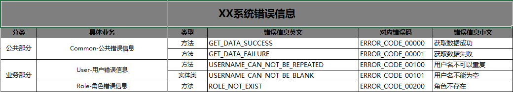

## 系统错误码开源项目

错误码信息在系统中非常重要。 一开始我们在做需求的时候，首先把系统中可能遇到的错误码根据业务模块给列出来, 这样有助于代码重用, 也避免在代码中直接将错误信息写死在代码中。本项目旨在标准化系统错误信息，复用代码。

本项目是根据文件 `error-code-template.xlsx` 来生成错误码对应的**常量文件**，以及 `error_code.properties` 配置文件。



以上图片是文件`error-code-template.xlsx` 文件的截图. 

错误信息管理一般分为两类

- 方法
- 实体类

对于方法，我们就要通过下面的代码来实现错误信息的获取

```java
@SpringBootTest
public class ErrorCodeUtilsTest {

    @Test
    public void getValue01() {
        // 这个方法就是获取表格中第四列对应的错误信息
        String errMsg = ErrorCodeUtils.getValue(ErrorCodeConstant.Common.GET_DATA_SUCCESS);
        assertEquals("获取数据成功", errMsg);
    }

    @Test
    public void getValue02() {
        // 这个方法就是获取表格中第四列对应的错误信息，可以向模板中传参数
        String errMsg = ErrorCodeUtils.getValue(ErrorCodeConstant.User.USERNAME_CAN_NOT_BE_REPEATED, "张三");
        assertEquals("用户名张三不可以重复", errMsg);
    }
}
```

对于实体类的话，因为有相应的校验框架，所以就可以用在校验参数的注解里

```java
public class UserDto {

    @NotBlank(message = ValidErrorMsgConstant.User.USERNAME_CAN_NOT_BE_BLANK)
    private String userName;

    private String password;
}
```

